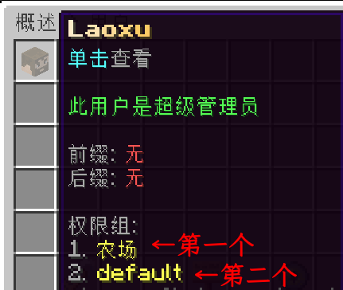

# 变量

以下是所有可用占位符的列表

此功能需要安装插件 PlaceholderAPI

`%uperms\_has\_permission\_\<权限名\>%`

显示玩家是否拥有此权限

`%uperms\_has\_group\_\<权限组名\>%`

显示玩家是否是此权限组的成员

`%uperms\_inherits\_group%`

原文：Shows if the player inherits directly from a group or indirectly via other group

功能未知

`%uperms\_prefixes%`

显示玩家所有前缀

多个前缀时自动用空格隔开

`%uperms\_prefix%`

显示玩家的第一个前缀

`%uperms\_prefix\_color%`

显示第一个权限组的前缀颜色

`%uperms\_rank%`

显示玩家拥有的第一个权限组名称

`%uperms\_ranks%`

显示玩家拥有的所有权限组名称

`%uperms\_rank\_timer%`

显示玩家第一个限时权限组的剩余时间（格式为：x天x小时）

如果是永久则会显示：Permanent

`%uperms\_rank\_timer\_detailed%`

显示玩家第一个限时权限组的剩余时间（格式为：x天x小时x分钟x秒）

如果是永久则会显示：Permanent

`%uperms\_rank\_timer\_\<权限组名\>%`

显示特定限时权限组的剩余时间（格式为：x天x小时）

如果是永久则会显示：Permanent

`%uperms\_rank\_timer\_detailed\_\<权限组名\>%`

显示特定限时权限组的剩余时间（格式为：x天x小时x分钟x秒）

如果是永久则会显示：Permanent

`%uperms\_secondaryprefix%`

显示玩家第二个权限组的前缀

`%uperms\_secondarysuffix%`

显示玩家第二个权限组的后缀

`%uperms\_suffixes%`

显示玩家的所有后缀，多个后缀会用空格隔开

`%uperms\_suffix%`

显示玩家的第一个后缀

`%uperms\_suffix\_color%`

显示第一个权限组的后缀颜色

`%uperms\_\<玩家名\>\_permission\_timer\_\<权限\>%`

显示指定玩家的指定限时权限的剩余时间（格式为：x天x小时）

`%uperms\_\<用户名\>\_permission\_timer\_detailed\_\<权限\>%`

显示指定玩家的指定限时权限的剩余时间（格式为：x天x小时x分钟x秒）

### [ 注意 ]

使用变量时请确保没有括号"<\>"，即删除括号"<\>"

文中的第一个与第二个指的是：

